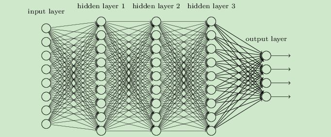

# 前言

此交流分享的目的：初步认识深度学习，尽量让大家能够开始啃论文。

交流暂时分为两个部分：**入门理论**与**代码实践**。

**入门理论**部分的目标是：让大家能够初步了解深度学习的主要步骤及其网络的各重要组成部分，弄明白各名词的基本意义。

**代码实践**部分的目标是：让大家能够初步构建简单的网络，并了解一些常用的超参调节方法，初步具备阅读论文的实现代码的能力。

后续看反响和时间可能会在最后加入**进阶理论**部分，

本次分享交流所需要的知识背景：（理论部分）高等数学或数学分析，线性代数，概率论，（实践部分）python基础语法

### 所谓人工智能

所谓深度学习：已知y、x，寻找映射关系f
$$
y=f(x)
$$

### 抽象的能力

人类特别是数学家极具抽象能力，我们能够从一些事物中抽取它们的共同或互异特征，然后划分为各类别，或是将某方法类比到某个其他相似场景中并指导我们的行动，又或是抽象或等效为某个模型以便用相应的数学运算来求解。

实际上，**抽象就是一种映射**。

但即便数学已经十分发达，有时候一些抽象还是难以用数学来表达，比如汽车驾驶、路况判断，闻香识女人等。我们人类能够很轻易做到的东西对计算机来说却十分困难，因为我们尚未能抽象出这些映射的数学本质，更不用说做成计算机看得懂的算法了。

于是寻找映射（或者说抽象出统计本质）的任务我们就交给计算机去做，这样便出现了深度学习。

深度学习就是通过网络抽象出某些人类难以发觉的统计特征，必要时再根据其他方法通过特征工程人为地从原始数据提取并向网络提供某些特征，以期加快计算机寻找映射$f$的速度（即加快收敛）和提高该映射的准确度。

### 万能近似定理(Universal Approximation Theorem)

一个前馈神经网络，只要具有**线性输出层**和至少一层具有任何“挤压”性质（非线性）的激活函数，只要给予网络足够数量的隐藏单元，它可以以任意精度来近似**<u>有限</u>维实空间**中**<u>有限</u>闭集**上的**任意连续函数**。

但由于数据过少，数据普遍性不足，以及优化算法、损失函数等其他因素的不足，实际上的DNN容易过拟合，进入极值陷阱，进而无法找到最值。（优化方法一章中会细说）

### 一个深度学习模型需要具备的

1. 输入层x（特征工程）
2. 输出层y（标注问题）
3. 隐藏层（由于其输出不可见故称隐藏层，所有隐藏层及其结构的集合又名框架，一般都是由三大基本模型及其变种组成）
4. 损失函数（用于衡量网络预测值的优劣）
5. 优化方法（提高收敛速度和预测准确度）

# DNN(or MLP)

深度神经网络（或称多层感知机），下图中每个圆为一个神经元

$$
Y=Activate_3(W_3Activate_2(W_2Activate_1(W_1X+B_1)+B_2)+B_3)
$$

$$
Assume: shape(H_1)=(9,1),shape(X)=(8,1)\to shape(W_1)=(9,8)
$$

### 反向传播算法Back Propagation

Loss函数对所有隐藏层的所有权重（w）与偏置（b）求偏导

	<!--将图片和文字居中-->

 		<!--换行-->
book's ForwardPropagation(left) and BackPropagation(right)	<!--标题-->

	<!--将图片和文字居中-->

 		<!--换行-->
my BackPropagation	<!--标题-->

##### 梯度爆炸与梯度消失

当反向传播时计算的梯度小于计算机计算精度（即为0）时称为**梯度消失**；当梯度过大以至于网络权值可能产生NaN值（无穷），进而在几个batch内导致整个网络的结果也为NaN，这种情况称为**梯度爆炸**。

### 激活函数

DNN与线性回归对比就多了个激活函数，也因此具有了表达非线性的能力

作用：使模型具有表达非线性的能力

#### 几种常见的激活函数

##### Sigmoid

$$
f(z)=\frac 1{1+e^{-z}}
$$

	<!--将图片和文字居中-->

 		<!--换行-->
sigmoid函数	<!--标题-->

	<!--将图片和文字居中-->

 		<!--换行-->
sigmoid梯度	<!--标题-->

缺点：

1. 激活函数计算结果（值域）不是以0为中心，这种情况会导致下一层的输入不含负数，故局部对权重w求偏导时所得结果均为正数，进而导致所有权重都往同一个方向更新（正负都由输入x决定了）；（不过其实这个问题不严重，若按batch训练，则每次更新时由于x变了，其方向也会跟着变）

1. 梯度最高为0.25，在层数变多的情况下容易出现梯度消失的情况；
2. 函数中含有幂函数，加大了计算机计算负荷；

##### tanh

$$
tanh(z)=\frac {e^z-e^{-z}}{e^z+e^{-z}}
$$

	<!--将图片和文字居中-->

 		<!--换行-->
tanh函数（左）及其梯度（右）	<!--标题-->

缺点：虽然解决了not zero-centered的问题，但其余问题仍然存在

##### ReLU

$$
ReLU(z)=max(0,z)
$$

	<!--将图片和文字居中-->

 		<!--换行-->
ReLU函数（左）及其梯度（右）	<!--标题-->

运算速度（FP）与收敛速度（BP）都原超sigmoid和tanh

缺点：

1. 输出不是以0为中心
1. 存在Dead ReLU Problem，指的是某些神经元可能永远不会被激活（当w对所有的样本计算后所得均为负值，则该神经元输出结果恒为常数0，故其梯度也永远为0，因此会导致导致相应参数永远不能被更新，于是也就永远不会激活了；进入这个状态一般存在两种途径：①参数初始化时就正好进入该状态 ②在训练过程中由于学习率过大，导致进入该状态；解决办法有：设置学习率时不要过大、AdaGrad等）

尽管存在这两个问题，但在实际情况中relu仍然有不俗的表现，在搭建网络时往往都会优先尝试relu。

##### Leaky ReLU

$$
LeakyReLU(z)=max(\alpha z,z)
$$

一般都设置$ \alpha=0.01 $

	<!--将图片和文字居中-->

 		<!--换行-->
LeakyReLU函数（左）及其梯度（右）	<!--标题-->

具有relu所有的优点，同时解决了Dead ReLU Problem，但实际情况中并不总是比relu好，甚至运算负荷还比relu稍微大了

##### ELU

$$
ELU(z)=
\begin{cases}
z, &if\ z>0 \\
\alpha (e^z-1),& otherwise
\end{cases}
$$

	<!--将图片和文字居中-->

 		<!--换行-->
ELU函数（左）及其梯度（右）	<!--标题-->

具有relu所有的优点，同时解决了Dead ReLU Problem，而且在0点斜率连续，但实际情况中并不总是比relu好，而且运算负荷比relu与LeakyReLU都要大

##### Softmax

Softmax一般用于分类任务中的输出层，其作用是对原始输出进行归一化并增大各类别间概率的差距，也就是可以将最终输出当成各类别的概率。
$$
Softmax(z_i)=\frac {exp(z_i)}{\sum_{c=1}^{C}exp(z_c)} \\
C\ is\ the\ total\ number\ of\ classes.
$$
对比不用指数的方法：
$$
Linear(z_i)=\frac {z_i}{\sum_{c=1}^{C}z_c}
$$
假设
$$
z_1,z_2,z_3=2,3,5
$$
则有
$$
Linear\ output=[0.2,0.3,0.5]\\
Softmax\ output=[0.04201007, 0.11419519, 0.8437947]
$$
由此可见，利用指数函数的高度非线性，可以对不同结果进行有效的分类。

### 损失函数

#### 从最小二乘法引入

最小二乘法为曲线拟合定义了一种Loss函数
$$
Loss(\hat y)=\sum_{i=1}^{N}(y_i-\hat y_i)^2
$$
用以评价该曲线的拟合准确度（Loss越低，准确度越高），因此最小二乘法实际上就是一个优化问题（以线性回归为例）：
$$
k=\mathop {argmin}_{k}(Loss)\\
b=\mathop {argmin}_{b}(Loss)
$$

#### NN中的Loss

与最小二乘法类似，Loss函数用于评价模型拟合准确度。

下面介绍几种常用的Loss函数。

##### MSE(Mean Square Error)

$$
Loss_{MSE}(\hat y)=\frac 1 {2N} \sum_{i=1}^{N}(y_{i}-\hat y_{i})^2
$$

	<!--将图片和文字居中-->

 		<!--换行-->
MSE函数图像	<!--标题-->

上述是一个N维样本的Loss计算公式，实际训练时往往一次反向传播会综合几个样本，而一般来说每次前向传播都只用一个样本$X^{(j)}$、只得到一个预测$Y^{(j)}$和一个损失$Loss^{(j)}$，而一次训练的总的**$Loss$**则为多个样本的平均。

一般来说$ y_i^{(j)} $通常表示第$j$个样本的第$i$个特征。

MSE假设了模型预测与真实值之间的误差服从标准高斯分布（即标准正态分布）。

##### MAE(Mean Absolute Error)

$$
Loss_{MAE}(\hat y)=\frac 1 N \sum_{i=1}^{N}|y_{i}-\hat y_{i}|
$$

	<!--将图片和文字居中-->

 		<!--换行-->
MAE函数图像	<!--标题-->

MAE假设了模型预测与真实值之间的误差服从标准拉普拉斯分布。

##### MAE和MSE的区别与利弊

1. **MAE收敛速度慢于MSE**。由于MSE的梯度是$-\hat y_{i}$，MAE的梯度则只有$±1$两种，因此无论是在远处（MAE梯度太小）或是在近处（MAE梯度过大），就算是用了能修改学习率的优化算法，收敛速度还是会比MSE慢。

2. **MAE对outlier的稳定性更好**。如图，当右侧出现了outlier时，拉普拉斯分布比高斯分布更具稳定性。或这么定性理解：由于MSE是平方项，故该outlier在MSE中会对Loss有更大贡献，导致梯度过大，使得模型不稳定。

	<!--将图片和文字居中-->

 		<!--换行-->
两种分布在出现outlier时的样本柱状图与概率密度函数图	<!--标题-->

因此，在选用Loss时要先假设误差服从的分布。

###### 拉普拉斯分布和高斯分布（仅了解）

**拉普拉斯分布**是指具有如下密度函数的分布：
$$
f(x|\mu,b)=\frac1{2b} exp({-\frac{|x-\mu|}{b}})
$$
**高斯分布**是指具有如下密度函数的分布：
$$
f(x|\mu,\sigma)=\frac1{\sqrt{2\pi}\sigma}exp(-\frac {(x-\mu)^2}{2{\sigma}^2})
$$

##### Huber Loss

$$
Loss_{Huber}({\hat y|\delta})=
\begin{cases}
\frac 1 {2N} \sum_{i=1}^{N}(y_{i}-\hat y_{i})^2, &if\ |y_{i}-\hat y_{i}|\le\delta \\
\delta(|y_{i}-\hat y_{i}|-\frac 12{\delta}), &if\ |y_{i}-\hat y_{i}|>\delta
\end{cases}
$$

	<!--将图片和文字居中-->

 		<!--换行-->
Huber函数图像（δ=1）	<!--标题-->

优点：Huber融合了MAE和MSE的优点，在误差接近0时收敛速度更快，同时对outlier的稳定性更高。

缺点：需要给定$\delta$，多了一个超参。

##### Cross Entropy

交叉熵损失函数，一般用作分类任务中的Loss。
$$
Loss_{CrossEntropy}(\hat y)=-\sum_{c=1}^{C}{y_{c}ln(\hat y_c)}
$$
一般$y_i$都是one-hot向量（即除了目标类别为1，其他均为0，如$[0,0,1]$）

# 输入层与特征工程

### 数据预处理

在数据输入到网络前，往往需要先进行数据预处理，将数据的范围压缩到$ [0,1] $

### 特征工程

发现x中对因变量y有明显影响作用的特征并提取

由此能够加快网络收敛速度和提高网络的表现

# 正则化

### 惩罚项

### Dropout

# 优化方法

机器学习：网格搜索、牛顿法等

深度学习：牛顿法（梯度下降Gradient Descent）

朴素梯度下降GD

单次梯度下降SGD

批量梯度下降BGD

# 超参数

一些模型无法学习的但又影响模型效果的参数（也就是除了w和b以外的其他所有参数），如网络结构、数据预处理中的某些参量、

### 验证集（validation set）

# CNN

