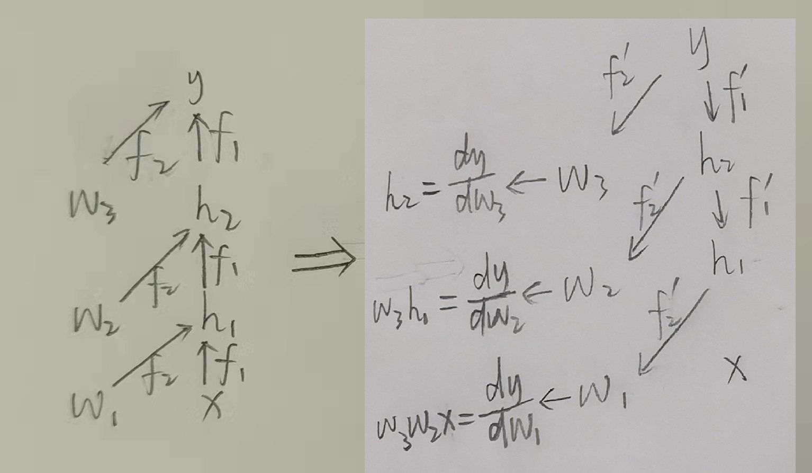
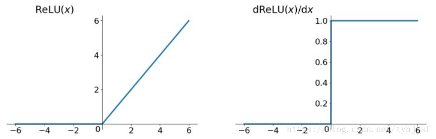

# 前言

此交流分享的目的：初步认识深度学习，尽量让大家能够开始啃论文。

交流暂时分为两个部分：**入门理论**与**代码实践**。

**入门理论**部分的目标是：让大家能够初步了解深度学习的主要步骤及其网络的各重要组成部分，弄明白各名词的基本意义。

**代码实践**部分的目标是：让大家能够初步构建简单的网络，并了解一些常用的超参调节方法，初步具备阅读论文的实现代码的能力。

后续看反响和时间可能会在最后加入**进阶理论**部分，

本次分享交流所需要的知识背景：（理论部分）高等数学或数学分析，线性代数，概率论，（实践部分）python基础语法

### 所谓人工智能

所谓深度学习：已知y、x，寻找映射关系f
$$
y=f(x)
$$

### 抽象的能力

人类特别是数学家极具抽象能力，我们能够从一些事物中抽取它们的共同或互异特征，然后划分为各类别，或是将某方法类比到某个其他相似场景中并指导我们的行动，又或是抽象或等效为某个模型以便用相应的数学运算来求解。

实际上，**抽象就是一种映射**。

但即便数学已经十分发达，有时候一些抽象还是难以用数学来表达，比如汽车驾驶、路况判断，闻香识女人等。我们人类能够很轻易做到的东西对计算机来说却十分困难，因为我们尚未能抽象出这些映射的数学本质，更不用说做成计算机看得懂的算法了。

于是寻找映射（或者说抽象出统计本质）的任务我们就交给计算机去做，这样便出现了深度学习。

深度学习就是通过网络抽象出某些人类难以发觉的统计特征，必要时再根据其他方法通过特征工程人为地从原始数据提取并向网络提供某些特征，以期加快计算机寻找映射$f$的速度（即加快收敛）和提高该映射的准确度。

### 万能近似定理(Universal Approximation Theorem)

一个前馈神经网络，只要具有**线性输出层**和至少一层具有任何“挤压”性质（非线性）的激活函数，只要给予网络足够数量的隐藏单元，它可以以任意精度来近似**<u>有限</u>维实空间**中**<u>有限</u>闭集**上的**任意连续函数**。

但由于数据过少，数据普遍性不足，以及优化算法、损失函数等其他因素的不足，实际上的DNN容易过拟合，进入极值陷阱，进而无法找到最值。（优化方法一章中会细说）

### 一个深度学习模型需要具备的

1. 输入层x（特征工程）
2. 输出层y（标注问题）
3. 隐藏层（由于其输出不可见故称隐藏层，所有隐藏层及其结构的集合又名框架，一般都是由三大基本模型及其变种组成）
4. 损失函数（用于衡量网络预测值的优劣）
5. 优化方法（提高收敛速度和预测准确度）

# DNN(Fully Connected Layer)

深度神经网络（或称多层感知机），下图中每个圆为一个神经元

$$
Y=Activate_3(W_3Activate_2(W_2Activate_1(W_1X+B_1)+B_2)+B_3)
$$

$$
Assume: shape(H_1)=(9,1),shape(X)=(8,1)\to shape(W_1)=(9,8)
$$

### 反向传播算法Back Propagation

Loss函数对所有隐藏层的所有权重（w）与偏置（b）求偏导

	<!--将图片和文字居中-->

 		<!--换行-->
book's ForwardPropagation(left) and BackPropagation(right)	<!--标题-->

	<!--将图片和文字居中-->

 		<!--换行-->
my BackPropagation	<!--标题-->

##### 梯度爆炸与梯度消失

当反向传播时计算的梯度小于计算机计算精度（即为0）时称为**梯度消失**；当梯度过大以至于网络权值可能产生NaN值（无穷），进而在几个batch内导致整个网络的结果也为NaN，这种情况称为**梯度爆炸**。

### 激活函数

DNN与线性回归对比就多了个激活函数，也因此具有了表达非线性的能力

作用：使模型具有表达非线性的能力

#### 几种常见的激活函数

##### Sigmoid

$$
f(z)=\frac 1{1+e^{-z}}
$$

	<!--将图片和文字居中-->

 		<!--换行-->
sigmoid函数	<!--标题-->

	<!--将图片和文字居中-->

 		<!--换行-->
sigmoid梯度	<!--标题-->

缺点：

1. 激活函数计算结果（值域）不是以0为中心，这种情况会导致下一层的输入不含负数，故局部对权重w求偏导时所得结果均为正数，进而导致所有权重都往同一个方向更新（正负都由输入x决定了）；（不过其实这个问题不严重，若按batch训练，则每次更新时由于x变了，其方向也会跟着变）

1. 梯度最高为0.25，在层数变多的情况下容易出现梯度消失的情况；
2. 函数中含有幂函数，加大了计算机计算负荷；

##### tanh

$$
tanh(z)=\frac {e^z-e^{-z}}{e^z+e^{-z}}
$$

	<!--将图片和文字居中-->

 		<!--换行-->
tanh函数（左）及其梯度（右）	<!--标题-->

缺点：虽然解决了not zero-centered的问题，但其余问题仍然存在

##### ReLU

$$
ReLU(z)=max(0,z)
$$

	<!--将图片和文字居中-->

 		<!--换行-->
ReLU函数（左）及其梯度（右）	<!--标题-->

运算速度（FP）与收敛速度（BP）都原超sigmoid和tanh

缺点：

1. 输出不是以0为中心
1. 存在Dead ReLU Problem，指的是某些神经元可能永远不会被激活（当w对所有的样本计算后所得均为负值，则该神经元输出结果恒为常数0，故其梯度也永远为0，因此会导致导致相应参数永远不能被更新，于是也就永远不会激活了；进入这个状态一般存在两种途径：①参数初始化时就正好进入该状态 ②在训练过程中由于学习率过大，导致进入该状态；解决办法有：设置学习率时不要过大、AdaGrad等）

尽管存在这两个问题，但在实际情况中relu仍然有不俗的表现，在搭建网络时往往都会优先尝试relu。

##### Leaky ReLU

$$
LeakyReLU(z)=max(\alpha z,z)
$$

一般都设置$ \alpha=0.01 $

	<!--将图片和文字居中-->

 		<!--换行-->
LeakyReLU函数（左）及其梯度（右）	<!--标题-->

具有relu所有的优点，同时解决了Dead ReLU Problem，但实际情况中并不总是比relu好，甚至运算负荷还比relu稍微大了

##### ELU

$$
ELU(z)=
\begin{cases}
z, &if\ z>0 \\
\alpha (e^z-1),& otherwise
\end{cases}
$$

	<!--将图片和文字居中-->

 		<!--换行-->
ELU函数（左）及其梯度（右）	<!--标题-->

具有relu所有的优点，同时解决了Dead ReLU Problem，而且在0点斜率连续，但实际情况中并不总是比relu好，而且运算负荷比relu与LeakyReLU都要大

##### Softmax

Softmax一般用于分类任务中的输出层，其作用是对原始输出进行归一化并增大各类别间概率的差距，也就是可以将最终输出当成各类别的概率。
$$
Softmax(z_i)=\frac {exp(z_i)}{\sum_{c=1}^{C}exp(z_c)} \\
C\ is\ the\ total\ number\ of\ classes.
$$
对比不用指数的方法：
$$
Linear(z_i)=\frac {z_i}{\sum_{c=1}^{C}z_c}
$$
假设
$$
z_1,z_2,z_3=2,3,5
$$
则有
$$
Linear\ output=[0.2,0.3,0.5]\\
Softmax\ output=[0.04201007, 0.11419519, 0.8437947]
$$
由此可见，利用指数函数的高度非线性，可以对不同结果进行有效的分类。

### 损失函数

#### 从最小二乘法引入

最小二乘法为曲线拟合定义了一种Loss函数
$$
Loss(\hat y)=\sum_{i=1}^{N}(y_i-\hat y_i)^2
$$
用以评价该曲线的拟合准确度（Loss越低，准确度越高），因此最小二乘法实际上就是一个优化问题（以线性回归为例）：
$$
k=\mathop {argmin}_{k}(Loss)\\
b=\mathop {argmin}_{b}(Loss)
$$

#### NN中的Loss

与最小二乘法类似，Loss函数用于评价模型拟合准确度。

下面介绍几种常用的Loss函数。

##### MSE(Mean Square Error)

$$
Loss_{MSE}(\hat y)=\frac 1 {2N} \sum_{i=1}^{N}(y_{i}-\hat y_{i})^2
$$

	<!--将图片和文字居中-->

 		<!--换行-->
MSE函数图像	<!--标题-->

上述是一个N维样本的Loss计算公式，实际训练时往往一次反向传播会综合几个样本，而一般来说每次前向传播都只用一个样本$X^{(j)}$、只得到一个预测$Y^{(j)}$和一个损失$Loss^{(j)}$，而一次训练的总的**$Loss$**则为多个样本的平均。

一般来说$ y_i^{(j)} $通常表示第$j$个样本的第$i$个特征。

MSE假设了模型预测与真实值之间的误差服从标准高斯分布（即标准正态分布）。

##### MAE(Mean Absolute Error)

$$
Loss_{MAE}(\hat y)=\frac 1 N \sum_{i=1}^{N}|y_{i}-\hat y_{i}|
$$

	<!--将图片和文字居中-->

 		<!--换行-->
MAE函数图像	<!--标题-->

MAE假设了模型预测与真实值之间的误差服从标准拉普拉斯分布。

##### MAE和MSE的区别与利弊

1. **MAE收敛速度慢于MSE**。由于MSE的梯度是$-\hat y_{i}$，MAE的梯度则只有$±1$两种，因此无论是在远处（MAE梯度太小）或是在近处（MAE梯度过大），就算是用了能修改学习率的优化算法，收敛速度还是会比MSE慢。

2. **MAE对outlier的稳定性更好**。如图，当右侧出现了outlier时，拉普拉斯分布比高斯分布更具稳定性。或这么定性理解：由于MSE是平方项，故该outlier在MSE中会对Loss有更大贡献，导致梯度过大，使得模型不稳定。

	<!--将图片和文字居中-->

 		<!--换行-->
两种分布在出现outlier时的样本柱状图与概率密度函数图	<!--标题-->

因此，在选用Loss时要先假设误差服从的分布。

###### 拉普拉斯分布和高斯分布（仅了解）

**拉普拉斯分布**是指具有如下密度函数的分布：
$$
f(x|\mu,b)=\frac1{2b} exp({-\frac{|x-\mu|}{b}})
$$
**高斯分布**是指具有如下密度函数的分布：
$$
f(x|\mu,\sigma)=\frac1{\sqrt{2\pi}\sigma}exp(-\frac {(x-\mu)^2}{2{\sigma}^2})
$$

##### Huber Loss

$$
Loss_{Huber}({\hat y|\delta})=
\begin{cases}
\frac 1 {2N} \sum_{i=1}^{N}(y_{i}-\hat y_{i})^2, &if\ |y_{i}-\hat y_{i}|\le\delta \\
\delta(|y_{i}-\hat y_{i}|-\frac 12{\delta}), &if\ |y_{i}-\hat y_{i}|>\delta
\end{cases}
$$

	<!--将图片和文字居中-->

 		<!--换行-->
Huber函数图像（δ=1）	<!--标题-->

优点：Huber融合了MAE和MSE的优点，在误差接近0时收敛速度更快，同时对outlier的稳定性更高。

缺点：需要给定$\delta$，多了一个超参。

##### Cross Entropy

交叉熵损失函数，一般用作分类任务中的Loss。
$$
Loss_{CrossEntropy}(\hat y)=-\sum_{c=1}^{C}{y_{c}ln(\hat y_c)}
$$
一般$y_i$都是one-hot向量（即除了目标类别为1，其他均为0，如$[0,0,1]$）

# 优化方法

### 优化的本质

让目标函数逼近或达到期望。

在深度学习中，理想的优化的目标函数是
$$
J(\pmb\theta)=\mathbb E_{(\pmb x,y)\sim p_{data}}L(f(\pmb x;\pmb\theta))\\
L\ Means\ Loss\ Function.
$$
实际中的优化目标函数
$$
J(\pmb\theta)=\mathbb E_{(\pmb x,y)\sim \hat p_{data}}L(f(\pmb x;\pmb\theta))\\
L\ Means\ Loss\ Function.
$$
区别就在于理想情况是直接拿**数据生成分布**$p_{data}$来计算均值或方差，实际情况是拿训练集来估计统计量并进行近似计算，也就是用$\hat p_{data}$来近似$p_{data}$（因为我们往往并不知道$p_{data}$），于是这就存在一个有偏和无偏的估计问题。

#### 无偏估计的本质（个人理解）

> 参考文献：《概率论与数理统计》

无偏估计的本质实际上就是在估计时**自由度不受限**。

举例：样本均值
$$
\overline X=\frac 1n\sum_{i=1}^{n}{X_i}
$$
易证样本均值是无偏估计

样本方差
$$
S_n^2=\frac 1n\sum_{i=1}^{n}{(X_i-\overline X)^2}
$$
易证
$$
\because E[S_n^2]=\frac {n-1}n {\sigma}^2
$$
显然是渐进无偏，因此才需要有修正样本方差
$$
{S_n^*}^2=\frac 1{n-1}\sum_{i=1}^{n}{(X_i-\overline X)^2}
$$
原因：样本方差定义中包含了一个约束条件$\overline X=\frac 1n\sum_{i=1}^{n}{X_i}$，导致了自由度损失1，进而需要使$\frac 1n \to \frac 1{n-1}$。

类比至深度学习中，定性理解：在多次用同一个分布$\hat p_{data}$计算并进行优化时，由于上一次的优化成为了这一次优化的约束，因此每一次优化之后都存在不同程度的自由度的损失，其直接表现就是模型越来越偏离$p_{data}$、接近$\hat p_{data}$，后果就是**估计损失越来越偏离实际损失**导致的**过拟合**。

**解决办法**：尽可能地逼近$p_{data}$。

由此我们可以导出**过拟合的定义**：模型的数据分布越来越偏离$p_{data}$而接近$\hat p_{data}$。

#### 深度学习中常见的优化困难

除了上述的过拟合困难外，还有由于损失函数定义欠完善、数据质量欠佳、网络过大过深等原因导致优化平面凸特性差的困难。

凸函数：可理解为二阶导符号不变，表现为其局部极值必为全局最值，故可通过寻找极值代替寻找最值。若凸特性差，也就是二阶导交变程度剧烈，那么越容易存在更多局部极小值，优化的速度也就更慢（凸特性差的平面可当成路上坑坑洼洼不够光滑）。

此外还有病态、权重空间对称性导致的局部极小值、悬崖等的问题，由于时间关系留待大家自行了解。但对于初学者来说，由于批量梯度下降等算法的优越性，大部分问题都能够解决，因此与调整网络结构相比，发现优化困难并制定相应的优化方法有时并不能获得更显著的提升。

### 梯度优化算法

#### 梯度下降Gradient Descent

$$
Original:J(\pmb\theta)=\mathbb E_{(\pmb x,y)\sim \hat p_{data}}L(f(\pmb x;\pmb\theta))\\
GD:J(\pmb\theta)\approx J(\pmb{\theta}^{(j)})+(\pmb\theta-\pmb{\theta}^{(j)})^T\nabla_xJ(\pmb{\theta}^{(j)})
$$

在点$\pmb{\theta}^{(j)}$处用一阶泰勒公式近似，此时$J(\pmb\theta)$的梯度为$\pmb g=-\pmb{\theta}^{(j)T}\nabla_xJ(\pmb{\theta}^{(j)})$，故更新参数为$\pmb{\theta}^{(j)}=\pmb{\theta}^{(j)}-\epsilon \pmb g$。

每次更新参数都要用所有样本计算Loss，收敛速度最快，但一旦进入极值点就无法跳出（因为是用一阶泰勒近似的），并且最容易过拟合（模型习惯了$\hat p_{data}$）。

#### 随机（或称在线）梯度下降Stochastic(Online) Gradient Descent

$$
Original:J(\pmb\theta)=\mathbb E_{(\pmb x,y)\sim \hat p_{data}}L(f(\pmb x;\pmb\theta))\\
SGD:J(\pmb\theta)=\mathbb E_{(\pmb x^{(i)},y^{(i)})\sim \hat p_{data}^{(i)}}L(f(\pmb x;\pmb\theta))\\
$$

每次更新参数只使用一个样本$(\pmb x^{(i)},y^{(i)})$，收敛速度最慢，但最容易跳出局部极小值点或鞍点（二维坐标系中称为拐点），也最不容易过拟合。原因：只用一个样本来近似$ p_{data}$，相当于模糊了数据生成分布对应的优化曲面，一定程度上忽略了某些极小值点。

#### 批量梯度下降Minibatch-Stochastic Gradient Descent

上述两种方法的折中，用小批量样本的$\hat p_{data}$来近似$p_{data}$，综合了两种方法的优点。

此外还有用二阶泰勒近似后进行优化的牛顿法等，自行了解。

### 参数初始化策略（自行了解）

一般是用均匀分布来初始化参数

### 自适应学习率算法（自行了解）

一般是为了解决过拟合问题。

# 数据预处理

在将数据输入网络输入层之前，往往需要先对原始数据进行预处理，或先提取其中特征。其实不仅是深度学习需要，许多数据或统计等相关领域都需要数据预处理。原因就是**数据质量决定网络性能上限，网络结构等其他超参数决定网络下限。**

几个基本的数据处理问题：

* 数据合法性：数据的类型、内容、大小或尺寸等的合法性（合乎代码语法），是网络对数据的基本要求（视网络而定，存在某些网络对尺寸无要求）
* 数据完整性：数据是否存在空值，字段是否完善，是否有漏掉
* 数据统一性：考察某一列的全部数值及特征值，是否存在单位、字段名与数值不匹配，是否存在离群值（与其他数据不在同一分布中）
* 数据唯一性：数据是否存在重复记录

深度学习领域的数据预处理一般都是解决**数据合法性**问题（因为我们用的数据绝大部分都是其他人做好的、初步处理过的数据集，当然出于严谨或者如果你的数据来源不是热门数据集，则需要重新根据上述的四个问题检查一遍你的数据），其余的三个问题一般是在做数据采集或是做特征工程时需要解决的。

### 数据合法性的预处理

考虑数据合法性，存在两个待解决问题：

1. 数据维度处理：**压缩或扩充**使得数据的维度满足网络要求，其中三种典型神经网络中**只有Fully Connected Layer（DNN中的全连接层）对输入数据的维度有要求**。（因为FC的权重与偏置参数的数量是需要固定的，而对同一个FC，若可训练参数数量固定，那么输入就只能接受一种维度，*<u>结合DNN图来理解</u>*）

2. **数据归一化**：将数据的取值范围按标准化步骤**压缩**到$ [0,1] $

$$
Z_i=\frac {X_i-\mu}{\sigma}=\frac {X_i-\overline X}{\sum_{i=1}^{N}{|X_i-\overline X|}}\\
\overline X=\frac 1N\sum_{i=1}^{N}{X_i}\\
Suppose\ that\ N\ is\ the\ sample\ size.
$$

数据归一化的原因：①网络的激活函数决定了网络对数据的敏感范围，现有大部分激活函数都在$ x\in[0,1] $部分。②做了归一化处理后，对Loss来说更方便衡量，对网络来说也更容易学习，否则最后计算出来$Loss$的值会很大，同时又由于数据分布在$[-\infin,+\infin]$，于是每一次权重更新会很剧烈（<u>*结合反向传播的图来理解*</u>），导致无法有效学习。

#### 由上述预处理引出的另外几个问题

进行非线性变换后信号的信噪比会改变。
$$
Consider\ a\ signal:Signal=100,\ Noise=5\to SNR=20\\
Linear\ Transformation(y=\frac 12 x):Signal=50,\ Noise=2.5\to SNR=20\\
Nonlinear\ Transformation1(y=\sqrt x):Signal=10,\ Noise=\sqrt 5\to SNR=2\sqrt 5\approx4.472\\
Nonlinear\ Transformation2(y=x^2):Signal=10000,\ Noise=25\to SNR=400\\
$$

$$
Consider\ a\ signal:
$$

因此为了不让信噪比变化，尽量采用线性的压缩或扩充方法（若信噪比降低，噪声过大，显然影响模型训练；若信噪比提高，噪声过小，则模型泛化能力较差。而有时候为了提高模型泛化能力，甚至会加入噪声，这个放到正则化章节细说）。注意**此处的信噪比均指训练集的**。

> 疑问：那我对测试集等其他输入也进行完全相同的变换（f完全相同），信噪比同升共降，这问题不就解决了？

> 答：注意，模型训练有一个原则是“**除了训练集，其他的数据均对网络不可见**”，因此无论是测试集还是待测数据都要用训练集的统计量来进行变换，除非定义一个不带统计量的变换，否则这个变换在非训练集数据上就不能做到完全相同。而归一化是几乎所有网络都需要的一个预处理步骤，那么在归一化上就没办法做到完全相同了。

此外，卷积计算是线性的，因此在图像处理领域就一般用卷积法进行上采样来压缩或下采样来扩充（也可以修改网络来配合相应数据，但需要重新训练，较不便，其中有一种操作是CNN后不接FC而是使用上采样卷积层，此即FCN-Fully Convolutional Network，如此以来输入图像维度就没有要求了）。而对于文本或语音等的一维序列型数据一般不存在维度问题，但往往也不能直接输入到网络中，往往需要先进行量化处理。

### 数据增强Data Augmentation

现实中数据的采集往往比较困难。于是我们可以**利用计算机，使用较少的人力生成一些更有代表性的数据**。

比如采用平移translate、翻转rotate、镜像flip等方法生成新的图像并采用与原图一致的标注$y$。如此一来，网络就具备了对上述方法的鲁棒性（robustness）。

### 特征工程Feature Engineering

Wikipedia:

> Feature engineering is the process of using domain knowledge of the data to create features that make machine learning algorithms work.

即：特征工程是利用**数据统计领域**的相关知识来创建使ML算法达到最佳性能的特征的过程。

要做的事：发现$X$中对因变量$Y$有明显影响作用的特征并提取或补充，由此能够加快网络收敛速度和提高网络的性能，提高网络泛化能力。

# 超参数

一些模型无法学习的但又影响模型效果的参数（也就是除了w和b以外的其他所有参数），如数据预处理中的某些参量、网络结构、损失函数、优化方法群（包括梯度优化、参数初始化、学习率自适应等各类优化方法）、正则化方法等。

### 验证集（validation set）

一个**从训练集中分出来的**、用于每次参数更新后加以验证的、**验证结果不直接作用于模型**、只用来供架构师衡量模型泛化性优劣并调整超参的**数据集**。

验证方法（测试集叫测试方法）在metric中设置，可自定义、也可用损失函数，一般都与测试集共享metric。验证方法与优化的目标函数类似但不会做成算法（如反向传播）作用于模型。

# 正则化

### 泛化的含义

在先前未观测到的输入上表现良好的能力被称为泛化。

### 正则化的含义

正则化的目的是**提高模型泛化能力**，也就是让测试集的测试结果变好。

模型在训练集上表现良好，在测试集上表现差的现象称为**过拟合**，其本质是模型的数据分布越来越偏离数据生成分布$p_{data}$而接近训练集分布$\hat p_{train\ dataset}$，这是**正则化**需要解决的问题（假设数据预处理不存在问题）。

模型在训练集上就已经表现不佳，即Loss没有下降到可接受的范围内，这种现象称为**欠拟合**，这是**优化方法**的问题（假设数据预处理不存在问题）。

正则化有很多种形式，但本质上都是在**调整模型的容量**（模型的容量是指其拟合各种函数的能力。比如一个线性回归模型只能拟合线性函数，不具有拟合二次函数的能力，也即容量不足；而一个能拟合多项式的模型在需要拟合一个二次函数时往往不能快速而准确地拟合成功，也即容量过大）。

但正则化一般都会降低模型收敛速度。

### 范数惩罚项

一般是在损失函数中加惩罚项
$$
\tilde J(\pmb \theta;\pmb X,\pmb y)=J(\pmb \theta;\pmb X,\pmb y)+\alpha \Omega(\pmb \theta)
$$
其中$\alpha \Omega(\pmb \theta)$即为惩罚项，一般使用范数形式，$\alpha\in[0,+\infin)$是权衡范数惩罚项$\Omega(\pmb \theta)$和标准目标函数$J(\pmb \theta;\pmb X,\pmb y)$相对贡献的超参数，$\alpha$越大正则化惩罚越大。

其中，通常不会添加对偏置的惩罚，因为每个神经元中只有一个偏置参数，也即每个偏置参数只控制一个变量（神经元输出），而权重参数通常是矩阵形式，   

本质：添加一个惩罚项来约束权重参数，以达到限制模型容量的目的。

##### L2

惩罚项是二范数的平方（也就是平方）
$$
\tilde J(\pmb \omega;\pmb X,\pmb y)=\frac\alpha2 \pmb\omega^T\pmb\omega+J(\pmb \omega;\pmb X,\pmb y)
$$
其对应梯度为
$$
\nabla_\omega \tilde J(\pmb \omega;\pmb X,\pmb y)=\alpha\pmb\omega+\nabla_\omega J(\pmb \omega;\pmb X,\pmb y)
$$
故参数更新时该惩罚项将会限制权重的增大。

下面是书上对L2正则化的进一步分析。二次近似用的是二阶泰勒公式。（使用近似只是为了得到$\nabla_\omega J(\pmb \omega;\pmb X,\pmb y)$的近似解析式，将问题简化以便后续分析。）

	<!--将图片和文字居中-->

 		<!--换行-->
L2详细分析	<!--标题-->

	<!--将图片和文字居中-->

 		<!--换行-->
图2.3	<!--标题-->

	<!--将图片和文字居中-->

 		<!--换行-->
图7.1	<!--标题-->

##### L1

$$
\tilde J(\pmb \omega;\pmb X,\pmb y)=\alpha |\pmb\omega|+J(\pmb \omega;\pmb X,\pmb y)
$$

对应梯度为
$$
\nabla_\omega \tilde J(\pmb \omega;\pmb X,\pmb y)=\alpha sign(\pmb\omega)+\nabla_\omega J(\pmb \omega;\pmb X,\pmb y)
$$
其中
$$
sign(x)=
\begin{cases}
1, &if\ x>0 \\
0, &if\ x=0 \\
-1, &if\ x<0
\end{cases}
$$
分析方法与L2类似，但需要**将Hessian矩阵进一步简化假设成实对角矩阵**，原因是L1惩罚项在使用完全一般化的Hessian矩阵近似时无法得到清晰的表达式（L2可以）。同时需要直接对$\tilde J(\pmb \omega;\pmb X,\pmb y)$近似。

结论：相比L2，L1会产生更稀疏的解（即更多的参数最后会被优化为0）

参考资料：

	<!--将图片和文字居中-->

 		<!--换行-->
L1	<!--标题-->

	<!--将图片和文字居中-->

 		<!--换行-->
（续上图）	<!--标题-->

### Dropout

在某次训练中以一定概率“丢弃”神经元（只在全连接上有），使其不再参与训练和参数更新，一定程度上有平均效果（相当于多个全连接模型求平均），能够实现正则化。

### 提前终止Early Stop

在模型满足某些条件时提前终止训练，比如若验证集在一定的训练次数N中不再下降则停止训练（这个次数N称为patience），能一定程度上实现正则化。

# CNN（Convolutional Layer）

